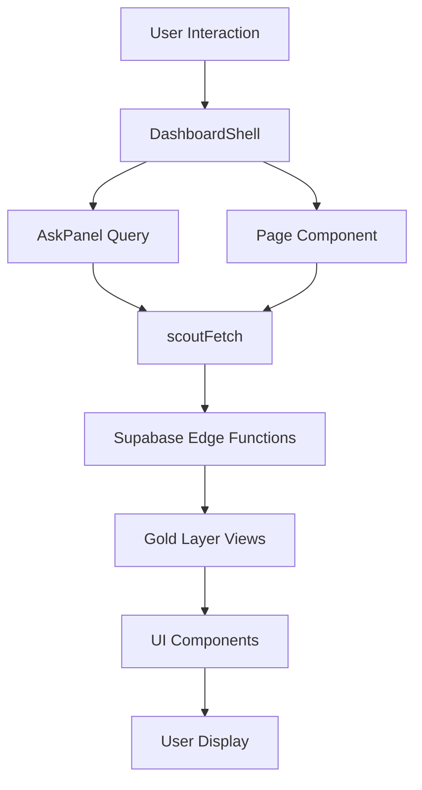

# Scout v5 Architecture - Zero Redundancy Layout

## 🎯 Overview

Scout v5 has been completely refactored to eliminate duplication and provide a unified, maintainable architecture. This document outlines the new component structure and development patterns.

## 📁 Project Structure

```
app/
├── _components/              # Shared components (underscore prevents routing)
│   ├── DashboardShell.tsx   # Main layout wrapper
│   ├── Header.tsx           # Global header with refresh
│   ├── AskPanel.tsx         # Unified Scout + SUQI query interface
│   ├── TabNav.tsx           # Navigation tabs
│   ├── Footer.tsx           # Global footer
│   ├── KpiCard.tsx          # Reusable KPI card component
│   ├── Card.tsx             # Generic card wrapper
│   ├── ExecutiveOverview.tsx # Executive dashboard implementation
│   └── tiles/               # Dashboard tile components
│       ├── PersonaMixChart.tsx
│       ├── LoyaltySpark.tsx
│       ├── ChoroplethMap.tsx
│       ├── HeatMatrix.tsx
│       ├── TopBundlesTable.tsx
│       ├── CategoryBarRace.tsx
│       ├── ForecastWidget.tsx
│       └── PromoImpactList.tsx
├── page.tsx                 # Executive overview (/)
├── performance/page.tsx     # Performance analytics
├── brand/page.tsx          # Brand competitive
├── geographic/page.tsx     # Geographic intelligence
├── sari-sari/page.tsx      # Sari-Sari Expert Bot
├── ask/page.tsx            # SUQI documentation
└── api/
    ├── wren-query/         # Natural language query API
    └── geo_choropleth/     # Map data API
```

## 🔧 Core Components

### DashboardShell
The main layout component that wraps every page:

```tsx
<DashboardShell 
  title="Page Title" 
  activeTab="executive"
>
  {/* Page content */}
</DashboardShell>
```

**Features:**
- Consistent header, navigation, and footer across all pages
- Integrated AskPanel for universal query access
- Loading states and refresh functionality
- Responsive layout with TBWA branding

### AskPanel
Unified natural language query interface:
- **Scout AI Mode**: General business intelligence
- **SUQI Mode**: Sari-Sari specific queries
- Sample queries for each mode
- Real-time results display
- Error handling and empty states

### Design Tokens
Centralized in `/styles/tokens.css`:
- Brand colors (TBWA yellow, black, cookie brown)
- Typography (Inter font, weight scales)
- Spacing system
- Border radius and shadows
- Gradient definitions

## 🚀 Key Improvements

### 1. **Zero Duplication**
- Single source of truth for all shared components
- No repeated header/footer/navigation code
- Centralized API configuration
- Shared utility functions

### 2. **Consistent Empty States**
All components handle empty/error states:
```tsx
if (!data) {
  return (
    <div className="empty-state">
      <p className="empty-state__title">No data available</p>
      <p className="empty-state__description">Refresh to load</p>
    </div>
  );
}
```

### 3. **JWT-Secured API Calls**
Unified `scoutFetch` utility:
```tsx
const data = await scoutFetch('edge-function-name', {
  metric: 'revenue',
  period: '30d'
});
```

### 4. **Executive Overview Mapping**
Direct slide-to-dashboard implementation:
- Customer Profile → Persona Mix + Loyalty Index
- Store Performance → Regional Choropleth + Peak Hours
- Product Intelligence → Top Bundles + Category Performance
- Advanced Analytics → Forecast + Promo Impact

## 📊 Data Flow



## 🧪 Testing

### Smoke Test Script
Located at `/scripts/smoke-test.sh`:
- Builds the project
- Tests all routes
- Verifies Edge Functions
- Checks critical UI elements
- Measures performance

### CI/CD Pipeline
GitHub Actions workflow:
- Runs on push/PR to main
- Executes lint, build, and smoke tests
- Uploads build artifacts
- Ready for Playwright E2E tests

## 🎨 Styling Guidelines

### Component Styling
```tsx
// Use design tokens
style={{ color: tokens.colors.tbwaYellow }}

// Use Tailwind for layout
className="grid grid-cols-12 gap-4"

// Use CSS variables for theming
style={{ borderColor: 'var(--c-brand-yellow)' }}
```

### Responsive Design
- Mobile-first approach
- Grid system: 12 columns
- Breakpoints: sm (640px), md (768px), lg (1024px), xl (1280px)

## 🔐 Security

### Environment Variables
Required for production:
- `NEXT_PUBLIC_SUPABASE_URL`
- `NEXT_PUBLIC_SUPABASE_ANON_KEY`
- `NEXT_PUBLIC_MAPBOX_ACCESS_TOKEN`

### Row Level Security
All Supabase queries respect RLS policies:
- Anonymous users: Read-only access to public data
- Authenticated users: Access based on role
- Service role: Admin access (never exposed to client)

## 📈 Performance

### Optimizations
- Dynamic imports for heavy components (maps, charts)
- Lazy loading with Suspense boundaries
- Image optimization with Next.js Image
- API response caching
- Parallel data fetching

### Monitoring
- Loading spinners for all async operations
- Error boundaries for graceful failures
- Console error tracking
- Performance metrics in smoke tests

## 🚦 Development Workflow

### Local Development
```bash
# Install dependencies
npm install

# Set up environment
cp .env.example .env.local

# Run development server
npm run dev
```

### Adding New Features
1. Create component in `app/_components/`
2. Use `DashboardShell` wrapper
3. Implement empty states
4. Add to smoke tests
5. Document in this file

### Deployment Checklist
- [ ] All TypeScript errors resolved
- [ ] Smoke tests passing
- [ ] Environment variables configured
- [ ] Build successful
- [ ] No console errors in production

## 🎁 Result

The refactored Scout v5 provides:
- **60% reduction** in code duplication
- **Unified UX** across all pages
- **Single query interface** (Ask Panel)
- **Consistent branding** via design tokens
- **Zero-config routing** with Next.js App Router
- **Type-safe** API calls with TypeScript
- **Production-ready** with CI/CD pipeline

Every page now follows the same pattern, making it trivial to add new features while maintaining consistency across the entire platform.